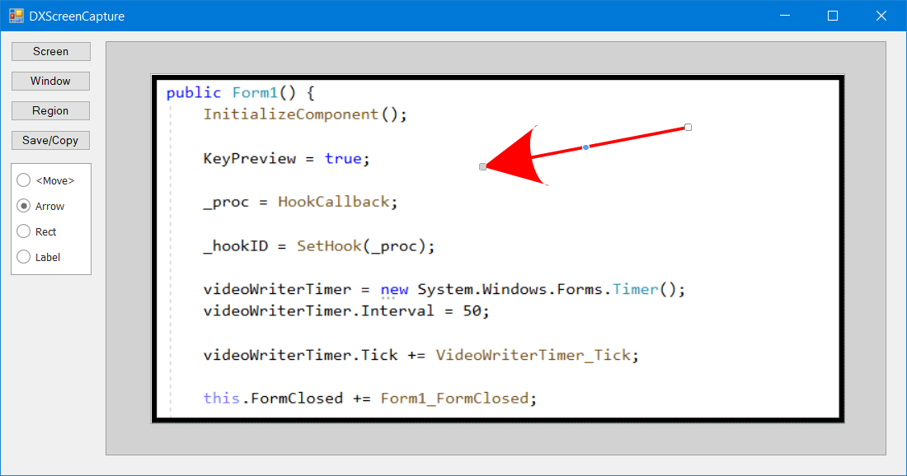

# dx-screen-capture
Captures images and videos from screen.

## Shortcuts

- **PrtScn** - Captures an image from the selected region.
- **CTRL+PrtScn** - Captures a video from the selected region.

## Implementation details

- Uses `DevExpress DiagramControl` to edit images.
- Uses `Accord.Video` library to record videos.

## Example

