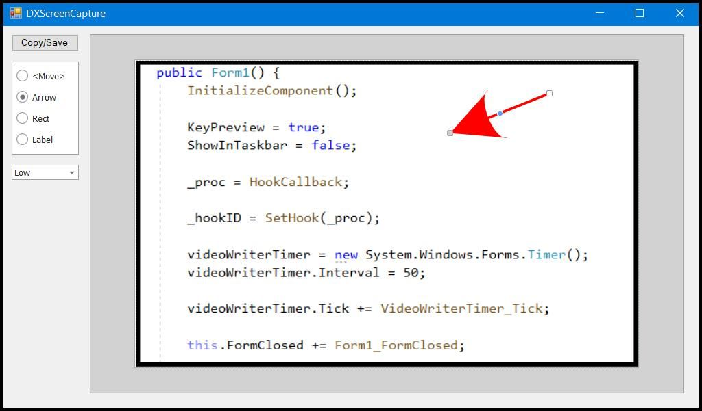

# dx-screen-capture
Captures images and videos from screen.

## Shortcuts

- **PrtScn** - Captures an image from the selected region.
- **CTRL + PrtScn** - Captures a video from the selected region.
- Hold **SHIFT** key to capture from the active window.

## Implementation details

- Uses `DevExpress DiagramControl` to edit images.
- Uses `Accord.Video` library to record videos.

## Useful features

- Minimizes size of the created files by reducing image quality.
- Copies the screenshot directly to the clipboard.
- Paint a frame over the screenshot.

## Example

